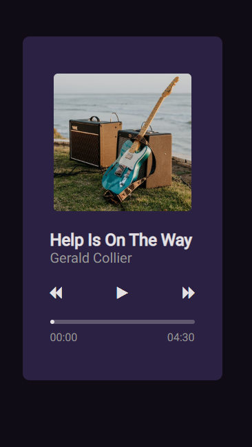
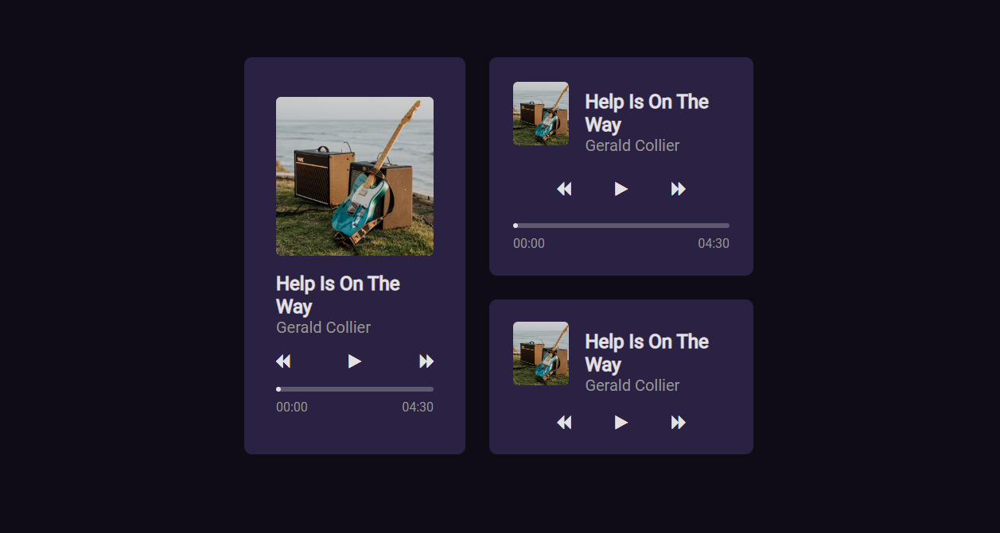

# Player de Música

## Descrição do Projeto

Um player de música feito para o desafio #01 do #boraCodar da @Rocketseat.
 

<h1 align="center">
  
</h1>

<h1 align="center">
  
</h1>

### Features

- [x] Responsivo
- [x] Permite interação com os botões play, pause, next, previous
- [x] Permite interação com o slider de áudio

### 🛠 Tecnologias

As seguintes ferramentas foram usadas na construção do projeto:

- [HTML](https://developer.mozilla.org/pt-BR/docs/Web/HTML)
- [CSS](https://developer.mozilla.org/pt-BR/docs/Web/CSS)
- [Javascript](https://developer.mozilla.org/pt-BR/docs/Web/JavaScript)

### Autor
---

Feito por Nathalia Azevedo 👋🏽 Entre em contato!

